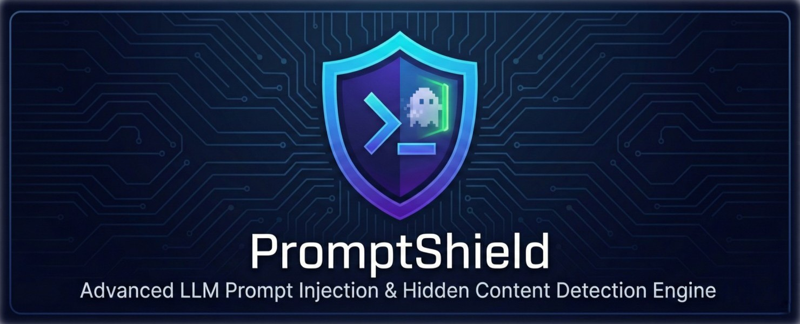

# @promptshield/vscode 



<p className="flex gap-2">
  <a href="https://github.com/promptshield-io/promptshield/actions/workflows/ci.yml" rel="noopener noreferrer">
    
  </a>
  <a href="https://codecov.io/gh/promptshield-io/promptshield/tree/main/packages/@promptshield/vscode" rel="noopener noreferrer">
    
  </a> 
  <a href="https://npmjs.com/package/@promptshield/vscode" rel="noopener noreferrer">
    
  </a>
  <a href="https://npmjs.com/package/@promptshield/vscode" rel="noopener noreferrer">
    
  </a>
  <a href="https://npmjs.com/package/@promptshield/vscode" rel="noopener noreferrer">
    
  </a>
  
</p>

> **Real-time visual security** for prompt engineering. Detects and visualizes hidden "ghost" characters, directional overrides, and malicious Unicode within the VS Code editor.

---

## ✨ Features

- **X-Ray Vision**: Instantly reveals invisible characters (ZWSP, NBSP) and BIDI overrides with distinct decorations.
- **Real-Time Diagnostics**: Highlights threats with squiggly lines (Red for Critical, Yellow for High).
- **Quick Fixes**: One-click remediation for common threats (e.g., "Remove invisible character").
- **AI-Powered Fixes**: Leverages GitHub Copilot (or compatible LM) to semantically repair injected prompts.
- **Status Bar Integration**: Shows current file health at a glance.
- **Detailed Reports**: `Cmd+Shift+P` > `PromptShield: Show Detailed Report` to see a list of all threats in the file.
- **Workspace Scan**: Audit your entire project with a single command.

---

## 🚀 Usage

### Installation

Install via the Visual Studio Code Marketplace:
[**PromptShield on Marketplace**](https://marketplace.visualstudio.com/items?itemName=mayank1513.promptshield)

### Commands

| Command                              | Description                                                                 |
| :----------------------------------- | :-------------------------------------------------------------------------- |
| `PromptShield: Scan Workspace`       | Triggers a full audit of the current workspace.                             |
| `PromptShield: Show Detailed Report` | Opens a quick-pick list of all threats in the active file.                  |
| `PromptShield: Toggle X-Ray`         | (Currently always active) Toggles visual overlays for invisible characters. |

### Configuration

Customize detection rules in `.vscode/settings.json` or your User Settings:

```json
{
  "promptshield.enable": true,
  "promptshield.trace.server": "verbose"
}
```

---

## 🎨 Threat Visualization

- **Invisible Characters**: Rendered as `[ZWSP]`, `[NBSP]`, etc., with a ghost text overlay.
- **BIDI Overrides**: Highlighted to show where text direction is being manipulated.
- **Homoglyphs**: Flagged to prevent visual spoofing attacks.

---

## License

This library is licensed under the MIT open-source license.

<hr />

<p align="center">with 💖 by <a href="https://mayankchaudhari.com" target="_blank">Mayank Kumar Chaudhari</a></p>
